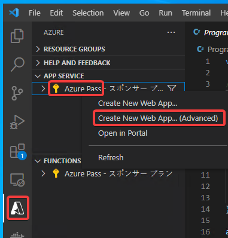

# ハンズオン: WebアプリをApp Serviceにデプロイする

Azure拡張機能のアイコンをクリック。

APP SERVICE内に表示されているAzureサブスクリプション（鍵のマークのアイコン）を右クリックし、「Create New Web App...(Advanced)」をクリック。

「Enter a globally unique name...」→「app（8桁程度の乱数）」といった適当な名前を入力。乱数部分はキーボードをランダムに叩いて決める。

「Select a resource group...」→「＋ Create new resource group」

そのままエンターキーを押してデフォルト値を受け入れる。

ランタイムの選択。「.NET 6 (LTS)」をクリック。

OSの選択。「Linux」

ロケーション（リージョン）の選択。「East US」をクリック

「App Serviceプラン」の選択。「＋Create new App Service plan」をクリック。

そのままエンターキーを押してデフォルト値を受け入れる。

「App Serviceプラン」の価格レベルの選択。Basic (B1)を選ぶ。

※「Free (F1)」も選べるが、各リージョンに作れるFreeプランは1個だけであることに注意。

Application Insightsの選択。「Skip for now」を選択。

以上で、アプリの作成が開始される。

※画面右下に以下のようなエラー「This subscription has reached the limit of 1 Free ... service plan(s) ...」と表示されてしまう場合は、すでにFreeプランが作られており、これ以上Freeのプランを作ることができない状態である。

この場合はこのページの手順を最初からやり直し、「App Serviceプラン」の価格レベルの選択で、Free (F1) 以外を選択する。

Webアプリが作成されたら、「Deploy」をクリック。

または、APP SERVICEの中で、作成したアプリを右クリックし、「Deploy to Web App...」をクリック。

無事デプロイが完了したら、以下のようなダイアログが表示される。「Browse Website」をクリックする。

または、Azure拡張機能の「APP SERVICE」のサブスクリプションを展開し、作成したWebアプリの「Browse Website」をクリックする。

Webブラウザが開き、デプロイしたWebアプリが表示される。

※デプロイしてすぐにWebアプリにアクセスすると、以下のようなエラー画面が出てしまう場合がある。1分ほど待ってから再度アクセス（リロード）すると、正常にアクセスできるようになる。

