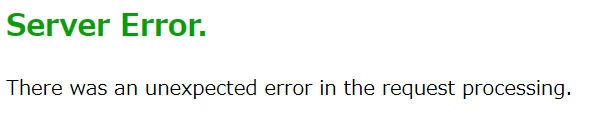

# ハンズオン: WebアプリをApp Serviceにデプロイする

Visual Studio Codeの、Azure拡張機能のアイコン（画面左側の「A」マーク）をクリック。

RESOURCES内に表示されているAzureサブスクリプション（鍵のマークのアイコン）を展開し、App Servicesを右クリックし、「Create New Web App...(Advanced)」をクリック。

「Enter a globally unique name...」→「app（8桁程度の乱数）」といった適当な名前を入力。乱数部分はキーボードをランダムに叩いて決める。

「Select a resource group...」→「＋ Create new resource group」

そのままエンターキーを押してデフォルト値を受け入れる。

ランタイムの選択。「.NET 6 (LTS)」をクリック。

OSの選択。「Windows」

ロケーション（リージョン）の選択。「East US」をクリック

「App Serviceプラン」の選択。「＋Create new App Service plan」をクリック。

そのままエンターキーを押してデフォルト値を受け入れる。

「App Serviceプラン」の価格レベルの選択。Basic (B1)を選ぶ。

Application Insightsの選択。「Skip for now」を選択。

以上で、アプリの作成が開始される。

Webアプリが作成されたら、「Deploy」をクリック。

または、APP SERVICEの中で、作成したアプリを右クリックし、「Deploy to Web App...」をクリック。

デプロイする（ローカルの）Webアプリを選択。

デプロイ用のコンフィグ（設定）を追加するかどうかの確認。「Add Config」をクリック。

デプロイをするかどうかの確認。「Deploy」をクリック。

この（ローカルの）Webアプリを、常に同じApp Service Webアプリへとデプロイするかどうかの質問。「Yes」

「Azure Developer CLI is not installed...」→ 「Later」

※[Azure Developer CLI](https://learn.microsoft.com/ja-jp/azure/developer/azure-developer-cli/overview) は、Azureアプリ開発を支援するコマンドラインツール。今回は利用しない。

無事デプロイが完了したら、以下のようなダイアログが表示される。「Browse Website」をクリックする。

または、Azure拡張機能の「APP SERVICE」のサブスクリプションを展開し、作成したWebアプリの「Browse Website」をクリックする。

Webブラウザが開き、デプロイしたWebアプリが表示される。

※デプロイしてすぐにWebアプリにアクセスすると、以下のようなエラー画面が出てしまう場合がある。1分ほど待ってから再度アクセス（リロード）すると、正常にアクセスできるようになる。

