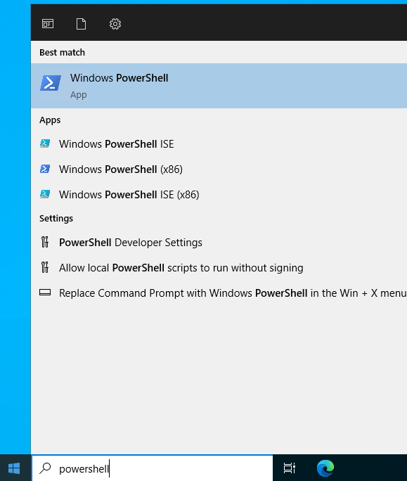
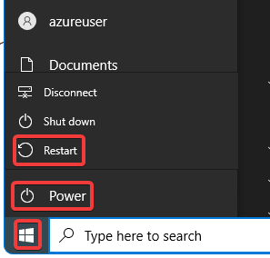
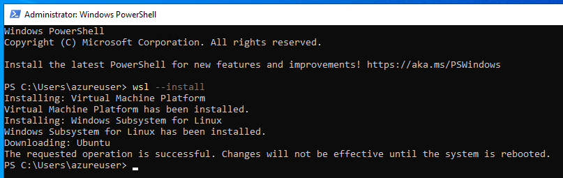
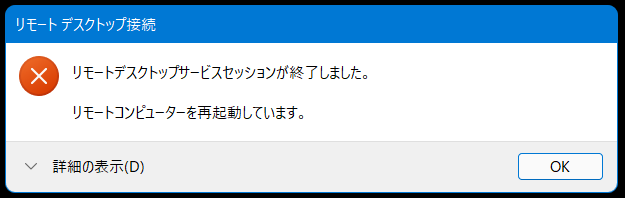
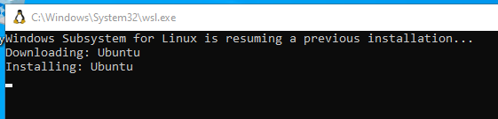
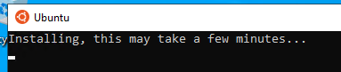
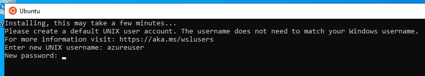
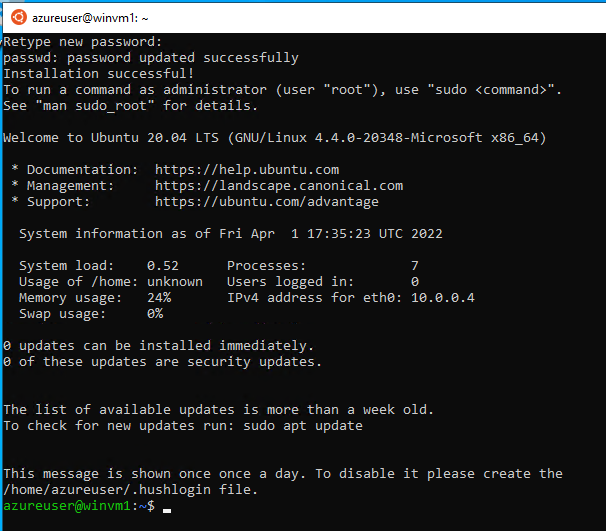
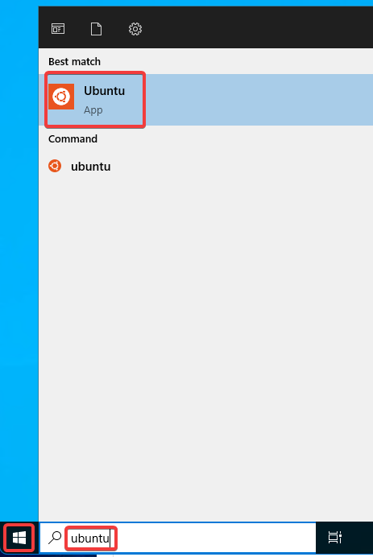

# WSL (Ubuntu)

画面左下のWindowsアイコンをクリックし、「powershell」と検索し、「Windows PowerShell」を起動する

`wsl --install` を入力する。

Windowsを再起動する

Continue

いったんリモートデスクトップ接続が切れるので、再度接続する

再起動・再接続後、自動的にUbuntuのインストールが開始される。

しばらく待つ。※10分ほどがかかる。

「Enter new UNIX username:」と出る。適当なユーザー名を入力する。

ユーザー名の例: `azureuser`

続いて「New password:」と出る。適当なパスワードを決めて入力する。

「Retype new password」と聞いてくるので、再度同じパスワードを入力。

以上で、WSL上でUbuntuが使えるようになった。

スタートメニューからは「ubuntu」で開ける。

