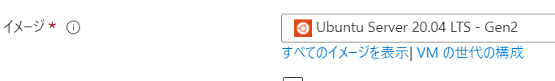
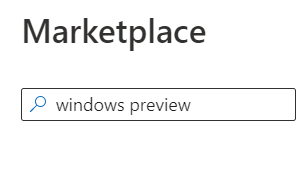
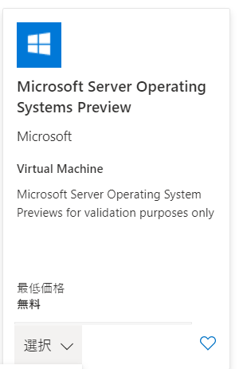
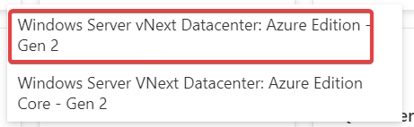

# WSL 2

「Windows Server Preview Build 22538」では、WSL 2を有効化できる。

https://level69.net/archives/29217

基本的に、こちらで紹介されている方法に従う。

Azureで「Windows Server Preview Build 22538」を起動するには、VM起動画面のイメージ選択にて「すべてのイメージを表示」をクリック。

Windows Preview で検索

「Microsoft Server Operating Systems Preview」の「選択」

「Windows Server vNext Datacenter: Azure Edition - Gen 2」をクリック

あとは通常通りVMを起動すればOK。

