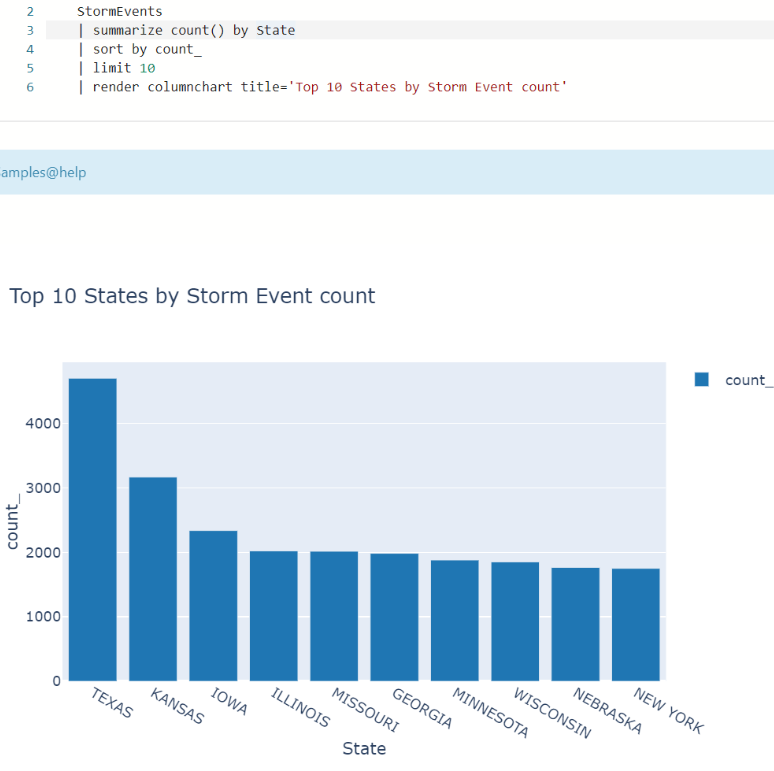

# Log Analytics

■Log Analyticsとは？

https://learn.microsoft.com/ja-jp/azure/azure-monitor/logs/log-analytics-overview

Log Analytics は、Azure Monitorに含まれるツール。

「Log Analyticsワークスペース」にデータを蓄積する。

データに対してクエリ（検索）を実行できる。

■Log Analyticsワークスペースとは？

https://learn.microsoft.com/ja-jp/azure/azure-monitor/logs/log-analytics-workspace-overview

ログ データを格納・蓄積する環境。

```
サブスクリプション
 └リソースグループ
   └Log Analyticsワークスペース
     └テーブル
       └列
```

■コスト

主に「データ取り込み」と「データ保存」に料金がかかる。

「データの取り込み」: Log Analyticsワークスペースに送信されたデータが課金の対象となる。

「データ保存」: 最初の 31 日間 (または Microsoft Sentinel がワークスペースで有効になっている場合は 90 日間) まで無料で保持できるが、それを超えると料金が発生。

コストの詳細: https://azure.microsoft.com/ja-jp/pricing/details/monitor/

■ログを表示するためのロール

https://learn.microsoft.com/ja-jp/azure/azure-monitor/roles-permissions-security#built-in-monitoring-roles

組み込みロール:

- 「Monitoring Reader」（監視閲覧者）
- 「Monitoring Contributor」（監視共同作業者）
  - 監視設定の作成または変更も可能

■他のAzureサービスとの関連

Azure VM、AKS、Microsoft Defender for Cloudなど: 自動的に「DefaultResourceGroup-...」という名前のリソースグループと「DefaultWorkspace-...」という名前のLog Analyticsワークスペースが作られ、そこにログが記録される。

Application Insights: [テレメトリ（アプリから集めたデータ）をLog Analyticsワークスペースに記録する。](https://learn.microsoft.com/ja-jp/azure/azure-monitor/app/create-workspace-resource)

Microsoft Sentinel: [Log Analyticsワークスペースに接続される。](https://learn.microsoft.com/ja-jp/azure/sentinel/quickstart-onboard)

Microsoft Defender for Cloud: [サーバー(Azure VM、オンプレサーバー、他クラウドのサーバー)にLog Analytics エージェントがインストールされ、エージェントはLog Analyticsワークスペースにデータを送信する。](https://learn.microsoft.com/ja-jp/azure/defender-for-cloud/monitoring-components)

■Log Analytics エージェント

https://learn.microsoft.com/ja-jp/azure/azure-monitor/agents/log-analytics-agent

VMやオンプレサーバーにインストールされる。ログとパフォーマンスデータを集めてLog Analyticsワークスペースに送信する。

https://learn.microsoft.com/ja-jp/azure/azure-monitor/agents/azure-monitor-agent-migration

Log Analytics エージェントは廃止予定で、2024 年 8 月 31 日を過ぎるとサポートされなくなる。後継の「Azure Monitor エージェント」を使用する。

■診断設定

https://learn.microsoft.com/ja-jp/azure/azure-monitor/essentials/diagnostic-settings?tabs=portal

Azureプラットフォームで発生するログをLog Analyticsなどに送信するための設定。

例: [Azureサブスクリプションの「アクティビティログ」の診断設定](https://learn.microsoft.com/ja-jp/azure/azure-monitor/essentials/activity-log?tabs=powershell)

```
Azureサブスクリプション
 └アクティビティログ
  ↓診断設定
  Log Analyticsワークスペース
```

例: [Azure ADテナントの「サインインログ」の診断設定](https://learn.microsoft.com/ja-jp/azure/active-directory/reports-monitoring/howto-integrate-activity-logs-with-log-analytics)

```
Azure ADテナント
 └サインインログ
  ↓診断設定
  Log Analyticsワークスペース
```

例: [Cosmos DBの「リソースログ」の診断設定](https://learn.microsoft.com/ja-jp/azure/cosmos-db/monitor-resource-logs?tabs=azure-portal)

```
Cosmos DB
 └リソースログ
  ↓診断設定
  Log Analyticsワークスペース
```

■デモ環境

https://portal.azure.com/#blade/Microsoft_Azure_Monitoring_Logs/DemoLogsBlade

サンプル データが多数含まれているデモ環境（Log Analyticsワークスペース）が利用できる。

# KQL (Kusto Query Language)

■KQLとは？

https://learn.microsoft.com/ja-jp/azure/data-explorer/kusto/query/

KQL(Kusto Query Language)は、データの探索、パターンの検出、異常値と外れ値の特定、統計モデリングの作成などを行うことができる強力なクエリ言語。

かなり大雑把に言えば、SQLのSELECT文のようなもの。

■例1

```kql
StormEvents
| where StartTime between (datetime(2007-11-01) .. datetime(2007-12-01))
| where State == "FLORIDA"
| count
```

「StormEvents」テーブルから、2007年11月1日～2007年12月1日の間の、州（State）がフロリダであるデータを検索し、件数をカウントする。

■例2

「StormEvents」テーブルから、州（State）ごとにデータ件数をカウントし、カウントの降順（多い順）に並べ、先頭10件を取り出し、棒グラフ（column chart）をレンダリングする。

```kql
StormEvents
| summarize count() by State
| sort by count_
| limit 10
| render columnchart title='Top 10 States by Storm Event count'
```




■参考: Kusto（クストー）とは？

https://ja.wikipedia.org/wiki/%E3%82%B8%E3%83%A3%E3%83%83%E3%82%AF%EF%BC%9D%E3%82%A4%E3%83%B4%E3%83%BB%E3%82%AF%E3%82%B9%E3%83%88%E3%83%BC

ジャック＝イヴ・クストー（英: Jacques-Yves Cousteau、1910年6月11日 - 1997年6月25日）は、フランスの海洋学者・地球科学者。アクアラングの発明者としても有名。

https://techcommunity.microsoft.com/t5/microsoft-sentinel/what-is-kusto/m-p/783661

Kusto は、Azure Data Explorerの内部名（開発コードネーム）。クストーの名前に因む。Azure Data Explorerと、それを基にして作られたLog Analyticsでは、データの検索にKusto Query Language（KQL）が使用される。


# Azure Data Explorer

■Azure Data Explorerとは？

https://learn.microsoft.com/ja-jp/azure/data-explorer/data-explorer-overview

大量のデータをほぼリアルタイムで簡単に分析できるようにする、フル マネージドかつハイ パフォーマンスなビッグ データ分析プラットフォーム。

「Azure Data Explorer クラスター」を作成し、そこにデータを取り込み、KQLで分析を行う。

■Azure Data Explorer サンプルデータ

https://dataexplorer.azure.com/clusters/help/databases/Samples

サンプルデータが含まれるAzure Data Explorerを試用できる。KQLの練習に便利。

help/Samples/Tables/Storm_Events/StormEvents と辿ると、サンプルのStormEventsテーブルにアクセスできる。

StormEvents（テーブル名）をダブルクリックすると以下のクエリが入力される。

```kql
StormEvents
|
```

たとえば以下のように`count`を追記して実行すると、データ件数をカウントされる。

```kql
StormEvents
| count
```

たとえば take 5 と追記して実行すると、テーブルのデータの最初の5件が取得される。

```kql
StormEvents
| take 5
```


ハンズオン: 以下の例1,例2を実行してみましょう。

■例1

```kql
StormEvents
| where StartTime between (datetime(2007-11-01) .. datetime(2007-12-01))
| where State == "FLORIDA"
| count
```

「StormEvents」テーブルから、2007年11月1日～2007年12月1日の間の、州（State）がフロリダであるデータを検索し、件数をカウントする。

■例2

「StormEvents」テーブルから、州（State）ごとにデータ件数をカウントし、カウントの降順（多い順）に並べ、先頭10件を取り出し、棒グラフ（column chart）をレンダリングする。

```kql
StormEvents
| summarize count() by State
| sort by count_
| limit 10
| render columnchart title='Top 10 States by Storm Event count'
```

# Log Analytics と Azure Data Explorer の関係

https://learn.microsoft.com/ja-jp/azure/azure-monitor/logs/log-analytics-overview#relationship-to-azure-data-explorer

- どちらもKQLを使用する
- Log AnalyticsはAzure Data Explorerを基に構築されている
- Log Analytics には、Azure Monitor 固有の機能が追加されている。

Azure Data Explorer Web UI は、主に Azure Data Explorer データベースのテーブルのデータに対してクエリを行う。

Log Analytics は、Log Analytics ワークスペースのテーブルのデータに対してクエリを行う。
