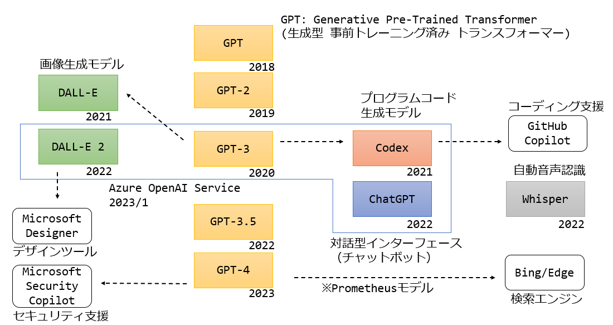
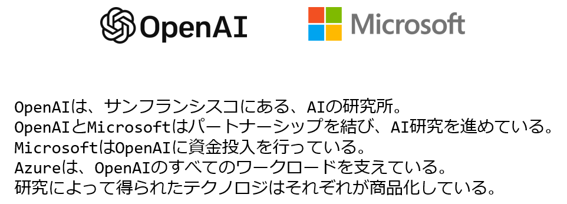

# Microsoft Security Copilot（セキュリティ コパイロット）

※コパイロット＝副操縦士

製品ページ:
https://www.microsoft.com/ja-jp/security/business/ai-machine-learning/microsoft-security-copilot?rtc=1

2023 年 3 月 28 日 発表。

プレスリリース:
https://news.microsoft.com/ja-jp/2023/03/29/230329-with-security-copilot-microsoft-brings-the-power-of-ai-to-cyberdefense/

■Security Copilotとは？

https://news.microsoft.com/ja-jp/2023/03/29/230329-with-security-copilot-microsoft-brings-the-power-of-ai-to-cyberdefense/

Security Copilot は、マイクロソフトの膨大な脅威インテリジェンスのリソースと業界をリードする専門知識とを組み合わせ、使いやすい AI アシスタントを通じてセキュリティ専門家を支援します。

Security Copilot は、脅威インテリジェンスを要約して理解しやすくすることで、複雑性を軽減し、セキュリティチームの能力を強化し、セキュリティ担当者がウェブトラフィックのノイズの中から悪意のある活動を特定できるよう支援します。

また、リアルタイムに、攻撃関連データを相関分析して要約し、インシデントの優先順位をつけ、多様な脅威を迅速に修復するための最適な行動を推奨することで、見逃しがちな情報をセキュリティチームが発見できるようにしてくれます。

https://wired.jp/article/microsoft-security-copilot-chatgpt-ai-breaches/

Security Copilotはネットワークに問題が起きた際にアラートを発し、ネットワーク内で何が起きているのか文字とグラフの両方で表示し、潜在的な調査の手順を提供する。

調査に関してまとめたスライドやその他のプレゼンテーション資料も自動的に作成してくれる。このためセキュリティチームが他部門の人たちや、特にセキュリティ分野での経験がなくても常に状況を把握しておく必要のある経営陣に状況を伝える上で役立つ。

https://topics.smt.docomo.ne.jp/article/itmedia_pcuser/trend/itmedia_pcuser-20230330_162?redirect=1

リアルタイムで攻撃関連データを相関分析して要約し、インシデントの優先順位をつけ、多様な脅威を迅速に修復するための最適な行動を推奨する。

■画面の例

https://pc.watch.impress.co.jp/docs/news/1489201.html

■どのように使う？

https://www.itmedia.co.jp/news/articles/2303/29/news096.html

「プロンプト」から自然言語で、例えば「最近のランサムウェア攻撃の傾向は？」と尋ねると、関連するデータやレポートを提示する。さらに「どう対策すべきか？」と入力すると、ベストプラクティスや推奨事項を提供する。

プロンプトにファイルを添付して怪しいものかどうかチェックを頼むこともできる。

https://japan.zdnet.com/article/35201841/

Microsoft Security Copilotを利用すれば、インシデントに数分以内に対応し、自然言語ベースの調査による重要な手順ごとのガイダンスを得て、Security Copilot以外の方法では検出できない攻撃を特定し、プロセスまたはイベントの概要を得ることができる。

Security Copilotには、セキュリティ関連の質問もできるため、社内のセキュリティ専門家のスキルを向上させるのにも役立つ。また、ユーザーとの対話から継続的に学習し、組織の環境に適応し、より安全な結果を得られるよう最適なアクションを提示してくれるようになる。

■入力したデータはどう扱われる？

https://www.itmedia.co.jp/news/articles/2303/29/news096.html

ユーザーのデータを、基盤となるAIモデルのトレーニングに使うことはない。

https://news.yahoo.co.jp/articles/06adac103c849d5a8ef04c6ffb25a1ca6ae80640

ユーザーのデータやビジネスプロセスで訓練されたAIは、ユーザーが属する組織のみが独占的に利用できる。

■どのようなAIモデルを使用している？

https://www.itmedia.co.jp/news/articles/2303/29/news096.html

米OpenAIの大規模言語モデル（LLM）「GPT-4」を採用している。

https://wired.jp/article/microsoft-security-copilot-chatgpt-ai-breaches/

Security Copilotは、OpenAIの大規模言語モデル「GPT-4」をベースとしている。ただし、マイクロソフト独自のセキュリティに特化したモデルも組み合わされていることを、同社は強調している。

https://project.nikkeibp.co.jp/idg/atcl/19/00001/00449/?ST=idg-cm-software&P=2

Microsoftが開発したセキュリティー固有のモデルを組み合わせたもので、セキュリティーを専門とする人たちが使う知識や用語を反映している。

Security CopilotはMicrosoft独自の脅威インテリジェンスや65兆以上のセキュリティーシグナルを常に反映している。

■参考: AIモデル(大規模言語モデル LLM)

■参考: OpenAIとMicrosoft

https://news.microsoft.com/ja-jp/2023/01/25/230125-microsoftandopenaiextendpartnership/ 

■AIが誤った判断を下す場合がある？

https://wired.jp/article/microsoft-security-copilot-chatgpt-ai-breaches/

Security Copilotが示唆したことが間違っていたり見当違いだったりした場合には、ユーザーは「Off Target」ボタンをクリックして「的外れ」であることを知らせることで、さらにシステムを訓練することができる。

https://project.nikkeibp.co.jp/idg/atcl/19/00001/00449/?ST=idg-cm-software&P=3

「Security Copilotは常に正しいわけではない。AIが生成するコンテンツには誤りが含まれることがある。だがSecurity Copilotはクローズドループの学習システムである。すなわち、利用者の方々から継続的に学習する仕組みで、製品に組み込まれている機能から利用者の方々が具体的なフィードバックを返せるようになっている。こうしたやりとりから学習を続ける中で、AIの反応を調整し、的確かつ有益で筋の通った回答を返せるようにしていく」

■いつから使える？

https://news.microsoft.com/ai-security-2023/

2023/3/31現在、Microsoft Security Copilot はプライベートプレビュー版。

Azure利用者側から利用を申し込むようなことはできない。

一般提供はまだされておらず、利用可能になる時期も公表されていない。

■料金は？

2023/3/31現在、まだ公開されていない。

