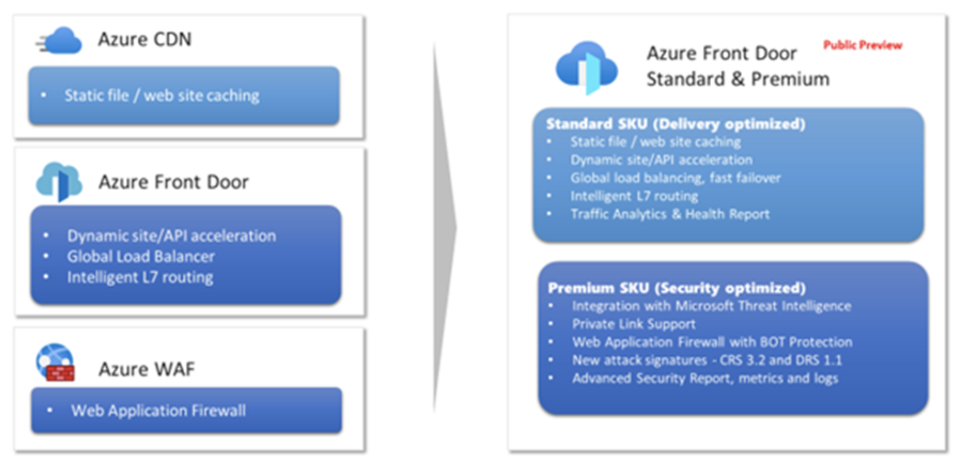

# Azure Front Door

[グローバルなウェブアプリケーションを高速に配信するためのセキュアでスケーラブルなエントリポイントを提供するサービス](https://ascii.jp/elem/000/004/017/4017782/)。待機時間/優先順位/重み付け/セッションアフィニティのルーティング方法を使用できる。L7で動作。

https://docs.microsoft.com/ja-jp/azure/frontdoor/front-door-overview

- レイヤー 7 (HTTP/HTTPS 層) で動作
- 正常性プローブ
- URLパスベースのルーティング
- SSLオフロード、証明書管理
- カスタム ドメインを利用可能
- WAFを利用可能

# 新しい Azure Front Door (Standard / Premium)

https://docs.microsoft.com/ja-jp/azure/frontdoor/standard-premium/overview

（従来の）Azure Front Door、Azure CDN、Azure WAFの機能を統合したもの。
