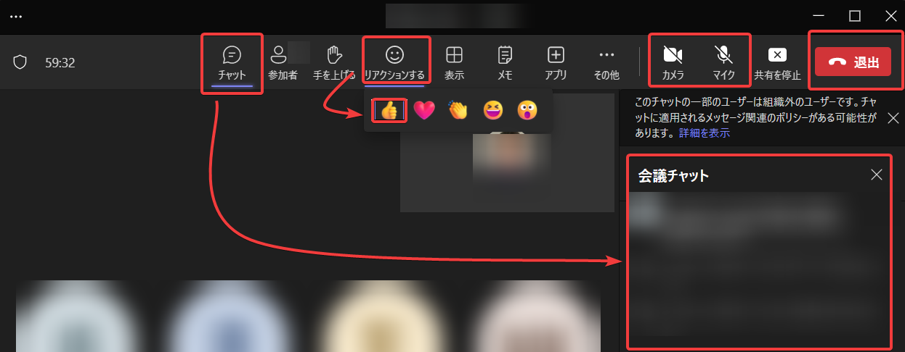

# 開始時のご案内

■講師自己紹介

- 別途ご案内いたします

■ご休憩について

- 集中力を維持していただくため、1時間に10分程度、休憩を取りながら進めていきます。
- 休憩時間はご質問、お飲み物の準備、トイレ休憩などにご利用ください
  - ご質問は休憩時間以外でもいつでもどうぞ！★質問大歓迎です★

■タイムテーブル(例)

進行状況により多少前後します。演習の有無などはコースや日程によります。

- 午前:
  - 9:30-12:00 講義
- ランチタイム 12:00-13:00 （講師離席中となります）
- 午後
  - 13:00-15:00 講義
  - 15:00～ オプション: ラボ（演習）、終わり次第順次ご退室

※1日コースの場合は講義はもう少し早く終わる場合があります。

<!--
講師は毎日 17:30 まで待機し、質問対応等サポートいたします。
-->

■録音・録画について

- 申し訳ございませんが、当方では、講義の録音・録画はご提供しておりません。あらかじめご了承ください。
- スクリーンショットをお取りいただくことは問題ございません。
  - 講義資料はすべてこのGitHubリポジトリに格納されていますので、スクリーンショットを取る必要はないかと思います。

■出席記録について

- Teams会議に参加されることで、出席が記録されます。
  - 「Day 1」「Day 2」といったように、それぞれの日ごとにTeams会議が作られていますので、当日用のTeams会議にご参加ください。
- 講師からの出席の確認（点呼など）は特にございません。

■ご受講者様の途中離席について

- ご受講者様のご都合による途中離席（「本日会議のため～時から～時まで離席いたします」「戻りました」など）について、講師へのご連絡は不要とさせていただきます。
  - 理由:
    - 離席のご連絡のやりとりが、他の受講者の集中の妨げとなる場合があります。
    - やりとりに時間を取られて講義の遅れにつながる場合があります。
- 受講できなかった部分については、後ほど講義資料をご確認ください。
  - 講義資料はすべてこのGitHubリポジトリにアップロードされております。

■Teamsの使い方

カメラ:

- 特に必要がなければカメラはオフに設定してください。

マイク:

- 特に質問がない場合はマイクをオフに設定してください。
- プライバシー保護のため、誤ってマイクがオンになっていると思われる場合は、講師側からミュート（マイクをオフにする）させていただく場合があります。あらかじめご了承ください。

チャット:

- 基本的にご質問はチャットで入力していただけると助かります。
- 皆様からの情報なども共有していただけると大変ありがたいです（「最近Azureでこんな機能が出ましたね」「こんな方法もありますよ」など）。

★チャットのテストをしてみましょう★

リアクション（「いいね」ボタン等）:

- 休憩・ランチからの再開時に、映像・音声が問題なく入っているかどうか、確認させていただく場合があります。講師からお願いしましたら「いいね」ボタンを押してください。

★リアクションボタンのテストをしてみましょう★

<!--
画面共有:

- ご質問（特にAzureの操作トラブル等）の際、必要に応じてご受講者様の画面を共有していただけると、トラブルシューティングがしやすいです。
- または、エラーメッセージや、画面のコピーを、チャットでお送りくださると、トラブルシューティングがしやすいです。
-->

■Teams トラブルについて

チャットが見えない、映像が出ない、音声が聞こえない等のトラブルが発生した場合、まずは講師までお知らせください。解決に向けてサポートいたします。

<!--
お客様の側では、以下の対処をお試しください。

- 切断・再接続してみる
- ネットワークを切り替えてみる
  - 会社ネットワークとご自宅ネットワーク等
  - VPN ON/OFF
- 使用する機材を変えてみる
  - 会社PC、個人PC、タブレット等
- Teamsアプリを変えてみる
  - デスクトップ版, Web版

また、Teamsのシステムトラブル等で、接続が勝手に切断されてしまう現象が発生する場合があります。その際はお手数ですが再接続をお願いいたします。

まれに、講師が使用している機材等でPC再起動などのトラブルが発生する場合があるかもしれません。なるべく早く復帰しますので、そのままお待ち下さい。
-->

■ご質問について

★質問大歓迎です★

- 質問される際に「手を挙げる」ボタンを押す必要はありません。
- チャットを使って質問する（おすすめ）
  - Teams会議チャットを利用して質問していただけると助かります。
  - 講義中でもかまいませんので、どしどしご質問ください。
- マイクを使って質問する
  - マイクを使用される際は、講義中（講師の解説中）ではなく、休憩時間や講義後など、区切りの良いタイミングで質問していただけるとありがたいです。
  - ご質問が終わりましたらマイクをOFFにしてください。
- ご質問の内容によりましては、お調べしてから回答いたしますので、回答までに少々お時間をいただく場合がございます。
- ご質問への対応はトレーニング最終日までとさせていただきます。
  - それ以降のご質問につきましては [Azureサポート](https://azure.microsoft.com/ja-jp/support) をご利用ください。

■チャット履歴について

恐縮ですが、いくつかの理由により、Teamsの会議チャットの履歴をまとめて送ることは難しいです。

- 一括エクスポートや保存などの機能がありません
- 全体を選択してコピーすることが難しいです
- 退室する等で、過去のチャットが消えてしまう場合があります

大変お手数ですが、重要と思われるチャットのテキスト（URL、質問へのご回答など）については、必要に応じ、各自での保存をお願いいたします。

<!--
■Microsoftアカウントのサインインについて

- サインイン時に「ご使用のアカウントがロックされました」と表示される場合があります。
- 携帯電話の電話番号を入力して「セキュリティコード」を受信し、受信したコードを入力すると、ロックを解除できます。
-->

■受講者アンケートについて

最終日の後半に、受講者アンケート（満足度調査）を実施させていただきます。

詳しい入力方法は、最終日の後半に、ご案内いたします。

※トレーニング受講中に、メールでも、アンケートのご案内（URL）が皆様に送信されますが、同じ内容を講師よりご案内いたしますので、メールのご案内のほうは無視していただいて大丈夫です。

# それでは、どうぞよろしくお願いいたします！

講義資料:

- [AZ-104](AZ-104-2023/README.md)
- [AZ-204](AZ-204/README.md)
- [AZ-305](AZ-305/README.md)
- [AZ-400](AZ-400/README.md)
- [AZ-500](AZ-500/README.md)
- [AZ-700](AZ-700/README.md)
- [SC-300](SC-300/README.md)
- [AI-102](AI-102/README.md)
- [AI-050](AI-050-2024/README.md)
- [AI-3003(nlp)](AI-3003-nlp/README.md)
- [AI-3004(visioon)](AI-3004-vision/README.md)
- [MS-4005(copilot)](MS-4005-copilot-prompt/README.md)

よろしければ、今回ご受講のコース以外の講義資料も、ご利用ください。

これらは公開している資料ですので受講者以外の方もご利用いただけます。
