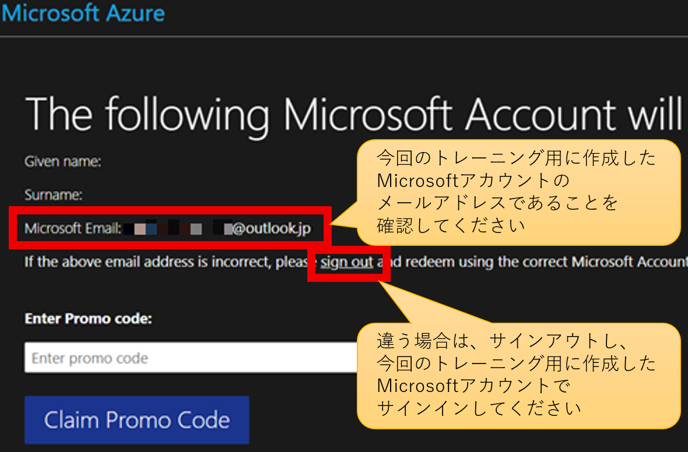
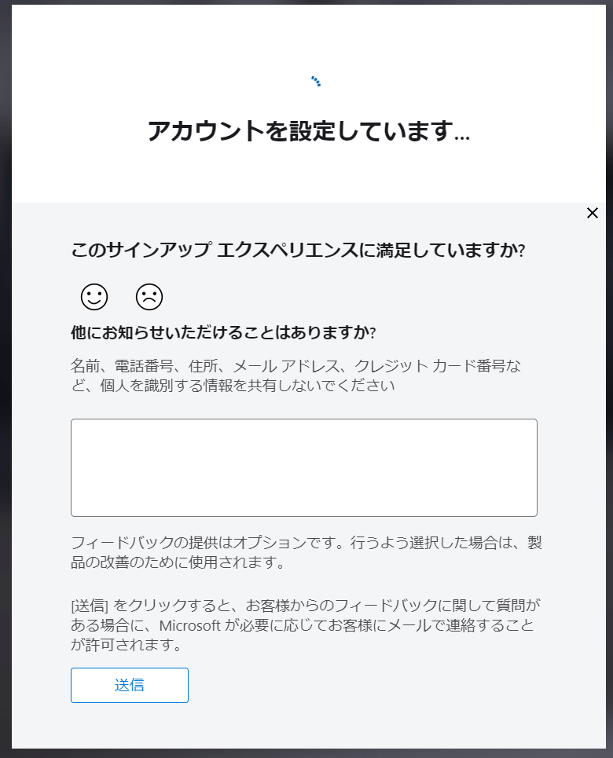
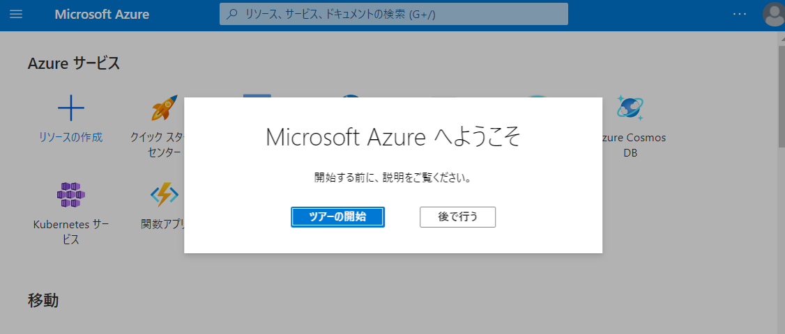
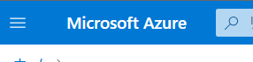
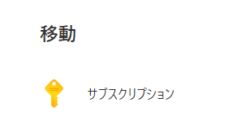
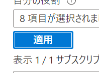
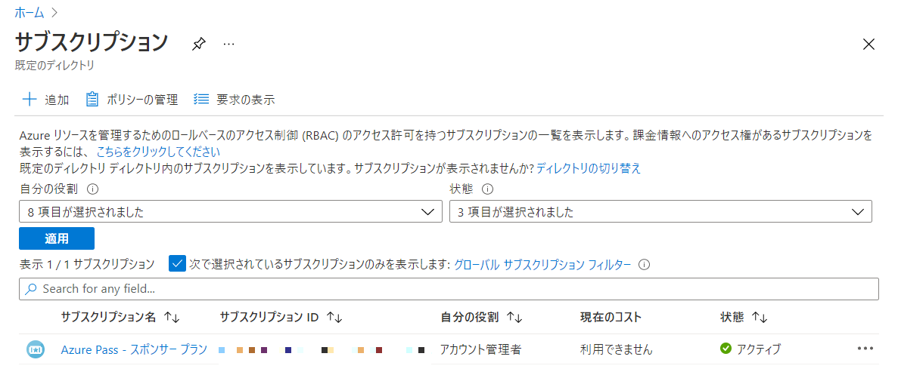
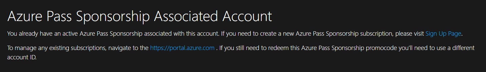
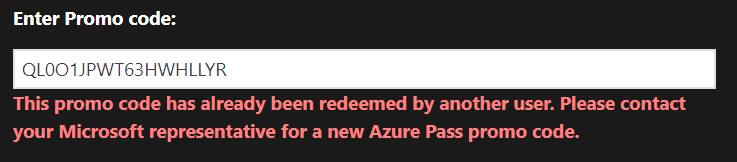
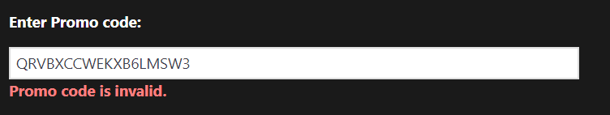

# Azure Pass サブスクリプションの入手

※8:30以降にならないと開始できません

## 事前の準備

- 今回のコース用に新しく作成したMicrosoftアカウント。まだ準備していない場合は[こちらの手順](msa.md)に従ってご準備ください。
- [ラボ環境 - Learn on Demand LMS (LODS)](https://esi.learnondemand.net/)で入手したPromo Code。まだPromo Codeを入手していない場合は、[こちらの手順](lods.md)に従ってPromo Codeを入手してください。

## 手順

- InPrivate ウィンドウを開きます。
  - Edge: [InPrivate ウィンドウ](https://support.microsoft.com/ja-jp/microsoft-edge/microsoft-edge-%E3%81%A7-inprivate-%E3%83%96%E3%83%A9%E3%82%A6%E3%82%BA%E3%82%92%E4%BD%BF%E3%81%86-e6f47704-340c-7d4f-b00d-d0cf35aa1fcc)を開きます。ショートカット キー: Ctrl + Shift + N
  - Chrome: [シークレット ウィンドウ](https://support.google.com/chrome/answer/95464)を開きます。
  - Firefox: [プライベート ウィンドウ](https://support.mozilla.org/ja/kb/private-browsing-use-firefox-without-history)を開きます。
  - Safari: [プライベートブラウズ ウィンドウ](https://support.apple.com/ja-jp/guide/safari/ibrw1069/mac)を開きます。
- InPrivate ウィンドウで、Azure Passのサイト（ https://www.microsoftazurepass.com/ ）にアクセスします。
- ページ内のStartボタンをクリックします。
- 今回のコース用に作成したMicrosoftアカウントでサインインします。
- 「Confirm Microsoft Account」ボタンをクリックします。
- **「Microsoft Email」の部分に、「今回のコース用に作成したMicrosoftアカウント」のメールアドレスが表示されていることを確認してください。**
- 
- 「Enter Promo Code」テキストボックスに、前の手順（ラボ環境での Promo Code の入手）で入手したPromo Codeを入力します。**トレーニングキーとPromo Codeは別のもの** ですのでご注意ください。
- 「Claim Promo Code」（プロモーションコードの要求）をクリックします。
- 「We are processing your request」というページが出ます。**「リロード」や「戻る」操作をせず、画面が切り替わるまで待ちます**。
- 「プロフィール（Your profile）」フォームで、氏名などの情報を入力します。
- 「次へ(Next)」をクリックします。※画面が切り替わるまで少し待ちます。リロードなどの操作を行わないでください。
- 「サブスクリプション契約、オファーの詳細、プライバシーに関する声明に同意します。(I agree to the subscription agreement, offer details, and privacy statement.)」にチェックを入れます。
- 「サインアップ（Sign Up）」をクリックします。**「リロード」や「戻る」操作をせず、画面が切り替わるまで待ちます**。
- 「お客様の情報を確認しています...」「アカウントを設定しています...」(Setting up your account...)などのメッセージが出ます。**「リロード」や「戻る」操作をせず、画面が切り替わるまで待ちます**。この間に画面に表示されるテキストエリア（サインアップ エクスペリエンスのフィードバック）には何も入力する必要はありません。
- 
- Azure portalの画面が表示されます。
- 
- 画面中央に「Microsoft Azureへようこそ」(Welcome to Microsoft Azure)と表示されます。「ツアーの開始」(Start tour)をクリックして、Azure portalの各部の使い方を確認します。
- 画面表示が英語になっている場合は、画面上部の歯車アイコン（Settings）をクリックし、「Languages + region」タブを選択し、「Language」で「日本語」を選択し、「Apply」をクリックします。
- 画面左上の「Microsoft Azure」をクリックしてホーム画面に戻ります。 
- 「移動」の「サブスクリプション」をクリックします。
- 「適用」ボタンをクリックします。
- **「Azure Pass - スポンサープラン」の行が表示されていることを確認します。** 

以上で、「今回のコース用に新しく作成したMicrosoftアカウント」で「Azure Pass - スポンサー プラン」Azureサブスクリプションが利用できるようになりました。

このサブスクリプションの有効期限や、クレジットの残高は、[Microsoft Azure Sponsorship クレジット残高](https://www.microsoftazuresponsorships.com/balance)のページで確認できます。

## 注意

Azure Passサブスクリプションの入手は、1つのMicrosoftアカウントに対して1回だけ実行できます。トレーニング開始時に、1回だけ実施していただければOKです。

## トラブルシューティング

エラーメッセージ「**Azure Pass Sponsorship Associated Account** - You already have an active Azure Pass Sponsorship associated with this account. 」

- 原因:
  - 以前、Azure Passサブスクリプションをすでに関連付けたことがある Microsoftアカウントを使用しています。
  - 1つのMicrosoftアカウントには、1つだけしか、Azure Passサブスクリプションを関連付けることができません。
- 対応:
  - 画面右上の「SIGN OUT」をクリックしてサインアウトします。
  - 今回のトレーニング用に、新しいMicrosoftアカウントを作ります。
  - このページの手順を再度実行してください。途中、新しいMicrosoftアカウントでサインインしてください。

エラーメッセージ「Try again later - Sorry there's something templrarily wrong with this site.」

- 原因：
  - このMicrosoftアカウントで、Azure Passサブスクリプションの入手に失敗している状態です。（失敗したけれども、すでに入手が行なわれたと、Azure Passのシステム側で判断されてしまっています。）
  - または、このMicrosoftアカウントで、すでに入手が行なわれています。
- 対処：
  - Microsoftアカウントをサイン アウトします。
  - 別のMicrosoftアカウントを作り直してください。
  - 作り直したアカウントで、再度、Azure Pass サブスクリプションの入手を行ってください。

エラーメッセージ「This promo code has already been redeemed by another user. Please contact your Microsoft representative for a new Azure Pass promo code.」

- 原因：
  - このPromo Codeはすでに使用済みとなっていて、使用できません。
  - 新しいPromo Codeを作るところからやり直す必要があります。
- 対処：
  - Microsoftアカウントをサイン アウトします
  - 別のMicrosoftアカウントを作り直してください
  - 作り直したアカウントで、[ラボ環境 - Learn on Demand LMS (LODS)](lods.md)にサイン インし、ラボを起動して、Promo Codeを再取得してください
  - 作り直したアカウントで、Azure Pass サブスクリプションの有効化を行ってください。

エラーメッセージ「Promo code is invalid.」

- 原因:
  - Promo Codeの入力に誤りがあります
  - 欠けている、または、余計な文字が追加されている
- 対処:
  - Promo Codeを正確に入力してください。余分な空白記号などが付かないようにしてください。
  - Promo Codeは18文字で、Qから始まる、大文字または数字のコードです。