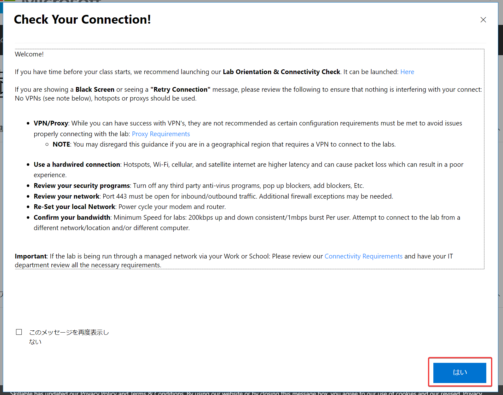
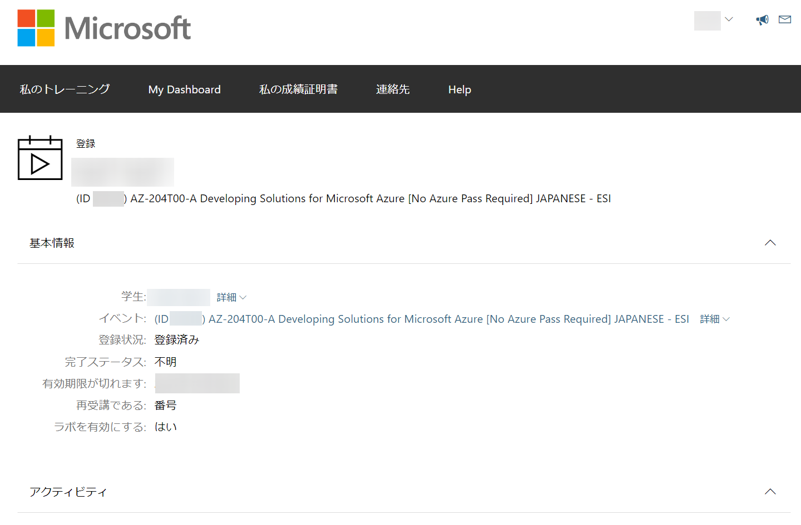

# ラボ環境へのサインイン

## 事前の準備

- 今回のコース用に作成したMicrosoftアカウント。まだ作成していない場合は、[新しいMicrosoftアカウントを作成](msa.md)してください。
- トレーニングキー。講師よりチャットでお伝えします。ご不明の場合は講師までお尋ねください。

## 手順

- [ラボ環境 - Learn on Demand LMS (LODS) (外部サイト)](https://esi.learnondemand.net/)にアクセスします。
- 「Sign In」ボタンをクリックします。
- 「How would you like to sign in?」では、「**Microsoft Account**」をクリックします。
- Microsoftアカウントへのサイン インが求められますので、今回のコース用に作成したMicrosoftアカウントでサイン インします。
- 「このアプリがあなたの情報にアクセスすることを許可しますか？」(Let this app access your info?)という画面では、「はい」(Yes)をクリックします。
- 「アカウントの更新」が表示された場合は、「名前」(First Name)と「名字」(Last Name)を入力し、「はい」(OK)をクリックします。
- 「トレーニングキーを利用する」(Redeem Training Key)をクリックします。
- トレーニングキーを入力し、「トレーニングキーを利用する」(Redeem Training Key)をクリックします。
- 画面の表示が崩れて表示される（字が重なって読めない）場合は、ページをリロードします。
- 「Check Your Connection!」というメッセージが表示された場合は、右下の「はい」をクリックして閉じます。
- 

以上で、ラボ環境へのサインインは完了です。

