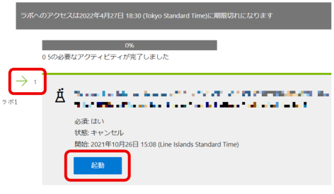
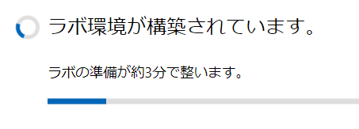
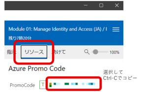

# ラボ環境での Promo Code の入手

※8:30以降にならないと開始できません

## 事前の準備

- 今回のコース用に作成したMicrosoftアカウント。まだ作成していない場合は、[新しいMicrosoftアカウントを作成](msa.md)してください。
- トレーニングキー。講師よりチャットでお伝えします。ご不明の場合は講師までお尋ねください。

## 手順

- [ラボ環境 - Learn on Demand LMS (LODS) (外部サイト)](https://esi.learnondemand.net/)にアクセスします。
- 「Sign In」ボタンをクリックします。
- 「How would you like to sign in?」では、「Microsoft Account」をクリックします。
- Microsoftアカウントへのサイン インが求められますので、今回のコース用に作成したMicrosoftアカウントでサイン インします。
- 「このアプリがあなたの情報にアクセスすることを許可しますか？」(Let this app access your info?)という画面では、「はい」(Yes)をクリックします。
- 「アカウントの更新」が表示された場合は、「名前」(First Name)と「名字」(Last Name)を入力し、「はい」(OK)をクリックします。
- 「トレーニングキーを利用する」(Redeem Training Key)をクリックします。
- トレーニングキーを入力し、「トレーニングキーを利用する」(Redeem Training Key)をクリックします。
- 「Check Your Connection!」というメッセージが表示された場合は、右下の「はい」をクリックして閉じます。
- 今回ご受講のコースのタイトル下にある「起動（Launch）」ボタンをクリックして、1つめのラボを起動します。
- 
- 新しいウィンドウが開き、ラボ環境の構築が始まります。5分ほどかかります。
- 
- 新しいウィンドウの右上の 「リソース」（Resources） をクリックします。
- 
- Promo Code をコピーし、**お手元のパソコンの**メモ帳などに貼り付けて記録します。次の工程で使用します。
- 新しいウィンドウ内の **「指示」（Instructions）の内容は実施する必要はありません** 。
- 新しいウィンドウは閉じてください。

以上の操作は、初日に1回だけ実施すればOKです。**ラボの実施のたびに「トレーニングキーを利用する」操作を行う必要はありません。**

# トラブルシューティング

■「トレーニングキーを利用する」(Redeem Training Key)が表示されません。「サイト管理」が表示されています。`https://esi.learnondemand.net/` にアクセスすると、`https://esi.learnondemand.net/Admin` にリダイレクトされてしまいます。

- 原因：
  - 受講者ではなく講師の権限でアクセスしているようです。
- 対処：
  - Microsoftアカウントをサイン アウトします
  - 念の為、Webブラウザを閉じ、再度Webブラウザを開きます。
  - 前の手順で作成した、新しいMicrosoftアカウントで、[ラボ環境 - Learn on Demand LMS (LODS) (外部サイト)](https://esi.learnondemand.net/)にサイン インしてください。

■「接続の問題？ ラボマシンへの接続が中断されたようです。接続の再試行」という表示が出ます。
- 原因：
  - 何らかのネットワーク的な問題により、ラボ環境への通信がうまくできていません。
  - Webブラウザの問題、ネットワーク回線の問題、ウィルス対策ソフトの問題などが考えられます。
- 対処：
  - 以下をお試しください。
    - 光回線、ポケットWI-FI、スマートフォンのテザリングなど、接続の仕方を変えてみる（講師の場合はこれでうまく繋がるようになりました）
    - 別のWebブラウザを使ってみる
    - VPNを使っている場合はOFFにする。（逆に、VPNを使っていない場合はVPNをONにしてみる）
    - 無線LANと有線LANを切り替えてみる
  - どうしてもつながらない場合は、ラボ環境を使わず、直接WebブラウザでAzure portal ( https://portal.azure.com/ )にアクセスしてラボを進めてください。

■キーボードから打ち込んだ文字が2重にタイプされてしまいます。例: hello → hheelllloo

- 原因:
  - ラボ環境の起動（または再起動）の直後、VMの負荷が高い場合に、現象が発生するようです。
- 対処:
  - ラボ環境が起動してから数分経過すると改善されます。しばらく待ってください。
  - それでも改善しない場合は、ラボ環境のウィンドウを閉じて、再度ラボ環境を起動してみてください。

■キーボードで記号の入力がうまくできません。

- 原因：
  - 英語キーボードと日本語キーボードの設定が一致していない
- 対処
  - ラボ環境内のWindowsで、キーボードの設定を修正します。
  - [設定手順例](https://qiita.com/Aida1971/items/ea754345828b2613bce6)
    - 仮想マシン側で Registry Editor (regedit.exe) を起動
    - `HKEY_LOCAL_MACHINE\SYSTEM\CurrentControlSet\Control\Keyboard Layouts\00000411` にある `Layout File` の値 `KBDJPN.DLL` を `KBD106.DLL` に変更
    - 仮想マシンを再起動

■手元のPCからラボ環境へのコピー・ペーストができません。
- 原因：
  - 通常のコピー・ペーストはできません。仕様となります。
- 対処：
  - 画面左上の雷マークのアイコン、テキストの入力、クリップボードのテキストを入力、と選択し、テキストボックスに、テキストを貼り付けます。すると、VMの環境のクリップボードに、そのテキストが転送されます。

